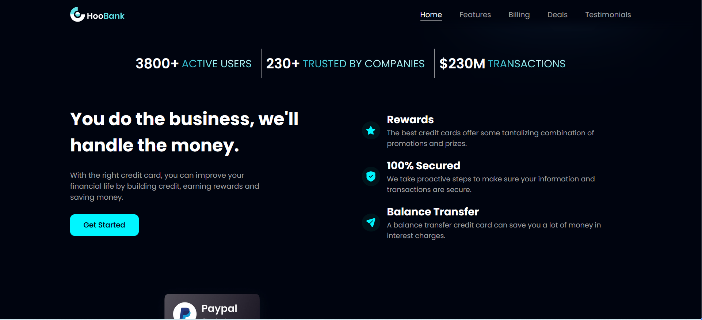
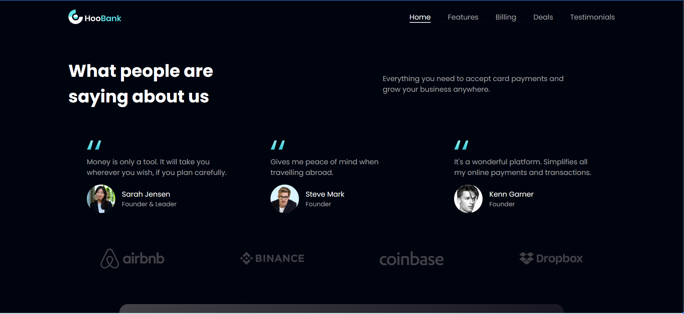
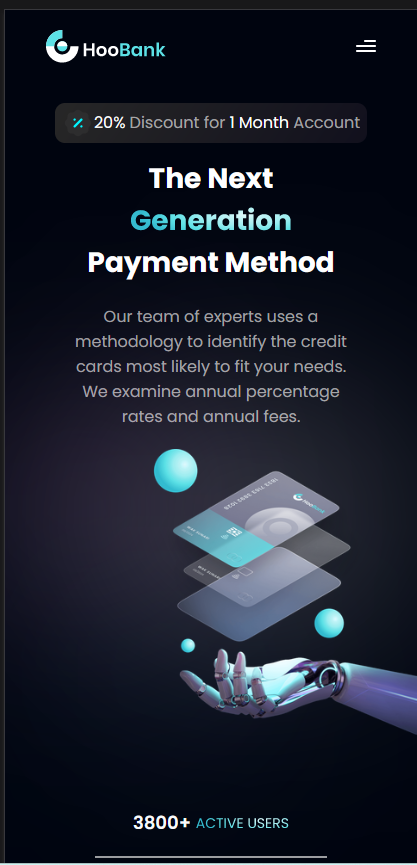
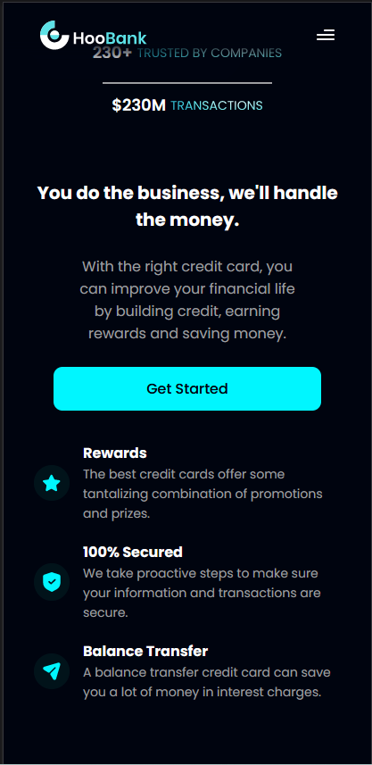
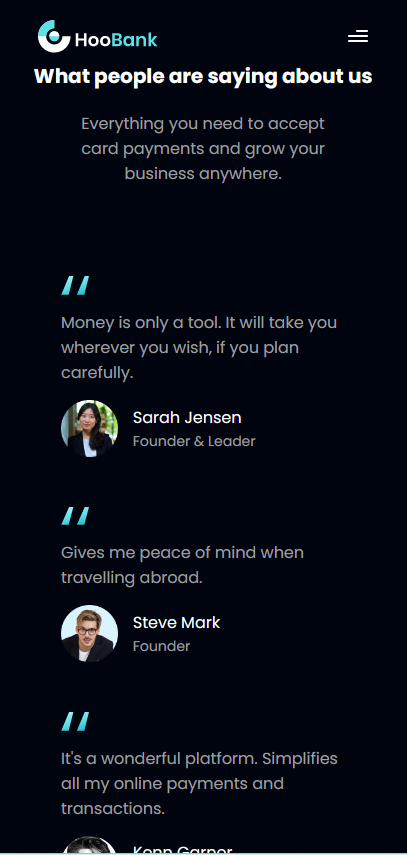

## HooBank Landing Page

### Created with:

- Vite
- React 18.2
- Typescript 4.9
- CSS

### Description:

The responsive landing page(LP) is a re-creation of this [design](https://www.figma.com/file/bUGIPys15E78w9bs1l4tgS/HooBank?type=design&node-id=310-485&mode=design). It has 6 sections: **Hero**, **Features**, **Billing**, **Deals**, **Testimonials** and **Footer**. Feel free to check the [live-demo]()

Throughout the LP, the menu is sticky on both the desktop version and mobile version. The menu has a faded-out lower border on desktop to provide a smooth transition between the menu container and the sections' content. Meanwhile, on mobile, it will display a blurry glass effect.

_External links and "Get Started" buttons are not functional_

### Desktop Screenshots:

## 

## 

## 

### Mobile Screenshots:

