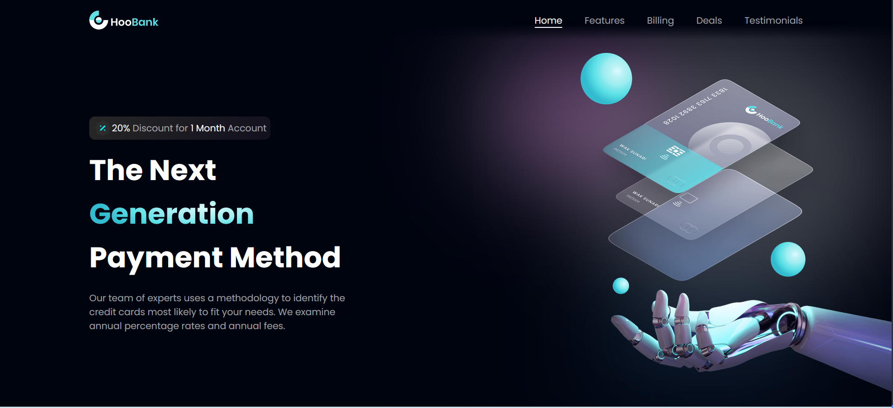

## HooBank Landing Page

### Created with:

- Vite
- React 18.2
- Typescript 4.9
- CSS

### Description:

The landing page(LP) has 6 sections: **Hero**, **Features**, **Billing**, **Deals**, **Testimonials** and **Footer**.
Through out the LP the Menu is sticky on both, the desktop version and mobile version. The menu has a faded out lower border to provide a smooth transition between the menu container and the sections' content.

**Hero section**:

**Features section**:

**Billing section**:

**Deals section**:

**Testimonials section**:

**Footer section**:

### Desktop Screeshots:

### Mobile Screenshots:
